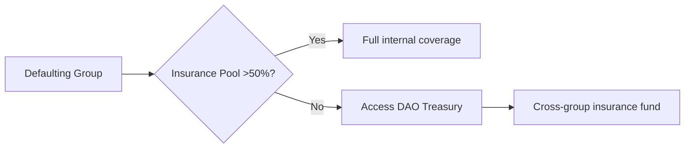

---

## 🧱 Core Functional Modules

### 1. 🏗️ Group Creation & Management

#### ✅ `create_group`

* Creates a new savings group.
* Stores:

  * Group name
  * Weekly contribution amount
  * Max number of members
  * Group duration
  * Creator address
  * Payout method (manual or random)
  * Token used (ERC20 address)

#### ✅ `get_group(group_id)`

* Returns group metadata like:

  * Name, creator
  * Members
  * Contribution settings
  * Current round and payout schedule

#### ✅ `get_members(group_id)`

* Returns a list of wallet addresses of all group members.

---

### 2. 👥 Member Management

#### ✅ `join_group(group_id, amount)`

* Checks if group is not full.
* Verifies `amount == weekly_amount * N` (where N = number of weeks you want to lock).
* Transfers the required tokens from the user to the contract.
* Stores locked funds for the user.
* Adds the user to the group's member list.
* Records participation start week.

#### ✅ `lock_liquidity(user, amount)`

* Called within `join_group`.
* Transfers `amount` of ERC20 tokens from the user to the contract.
* Stores in `locked_balance[user]`.

---

### 3. 💸 Weekly Contributions

#### ✅ `contribute(group_id)`

* Allows contribution only during the current week.
* Checks if user has enough locked funds.
* Deducts `weekly_amount` from the user's locked balance.
* Marks the user as "contributed" for the current week in storage.

---

### 4. 🔁 Rotating Payout System

#### ✅ `distribute_payout(group_id)`

* Can be triggered after all members contribute for a week.
* Sends the total pot to the next eligible recipient.
* Updates internal pointer to track who gets paid next.
* Marks recipient as "paid".

#### ✅ `get_next_recipient(group_id)`

* Returns the wallet address of the member scheduled to receive the next payout.

---

### 5. 📉 Reputation System

#### ✅ `report_default(group_id, user)`

* Called by group members or contract automatically.
* If user fails to contribute during a week:

  * Marks them as defaulted.
  * Decreases their reputation score.

#### ✅ `mark_late(group_id, user)`

* Marks user as having made a **late payment**.
* Reduces reputation slightly, but not as harshly as a full default.

#### ✅ `get_reputation(user)`

* Returns the current reputation score for a user.
* Based on history of:

  * Timely payments
  * Late payments
  * Missed contributions

---

### 6. 🔓 Fund Management

#### ✅ `withdraw_locked(group_id)`
✅ withdraw_locked(group_id)

Only allowed after the group cycle ends.
Complete Circle: Returns all remaining funds (no penalty).
Incomplete Circle: Applies penalty to remaining balance.
Penalty Formula: penalty = remaining_balance * penalty_percentage / 100.
Calculates remaining locked balance.
Transfers withdrawable funds back to the user.

✅ get_penalty_locked(user, group_id)

Returns the amount of funds locked as penalty for a specific user.
Provides transparency on penalty amounts.

✅ has_completed_circle(user, group_id) (Internal)

Checks if user completed full savings commitment.
Criteria: weeks_contributed >= weeks_committed AND (has_received_payout OR group finished).

---

implement a pool that will take one percent of the total locked funds and use it to cover the losses in case of default. and the project will take 20% from the pool if no one fail as contract maintanance 

Here are 5 critical stress test scenarios for your Esusu DAO model, examining how the insurance pool (DIP) and slashing mechanisms handle extreme cases. Each test includes **simulated math** using a 10-member group (₦10,000 weekly + 1% insurance = ₦10,100 total weekly payment).

---

### 🔥 **Stress Test 1: Multiple Early Defaults (Domino Effect)**  
**Scenario:**  
- Week 1: Member A (40% lock) takes payout, then defaults  
- Week 2: Member B (35% lock) takes payout, defaults  
- Week 3: Member C (30% lock) panics and defaults before payout  

**Loss Calculation:**  
- Total missed contributions: **₦270,000**  
  (3 defaulters × 9 weeks × ₦10,000)  
- Recovery:  
  - Slashed locks: A(150%×₦40k)=₦60k + B(150%×₦35k)=₦52.5k + C(100%×₦30k)=₦30k → **₦142,500**  
  - Insurance pool: 10 weeks × ₦1,000 = **₦10,000**  
- **Total recovery: ₦152,500**  
- **Shortfall: ₦117,500**  

**Protocol Response:**  
1. Payout priority reshuffled: Highest remaining lock (e.g., 32%) gets full ₦100k  
2. Partial payments: ₦152,500 - ₦100k = ₦52,500 → Distributed as ₦6,563 to remaining 8 members  
3. DAO triggers:  
   - Emergency vote to extend cycle by 4 weeks  
   - Reputation-based micro-loans for affected members  

---

### 🧨 **Stress Test 2: Market Crash (Asset Depreciation)**  
**Scenario:**  
- Members lock crypto (ETH) not stablecoins  
- ETH price drops 60% during cycle  
- 2 members default after payout  

**Loss Calculation:**  
- Lock value at join: ₦40k × 2 = ₦80k  
- Lock value at default: ₦32k (60% loss)  
- Slashed value: 150% of current value = ₦48k  
- **Actual recovery: 60% less than expected**  

**Protocol Response:**  
1. Automatic liquidation trigger:  
   - If locked asset drops >20%, require stablecoin top-up  
2. Insurance pool covers devaluation gap  
3. New rule: Progressive locks must use stablecoins  

---

### 💣 **Stress Test 3: Collusion Attack**  
**Scenario:**  
- 4 members form a Sybil group  
- All take early payouts (Weeks 1-4) then default  
- Reputation scores artificially inflated  

**Detection & Response:**  
1. **Sybil resistance:**  
   - On-chain behavior analysis flags identical transaction patterns  
   - DAO freezes payouts for investigation  
2. **Recovery:**  
   - Slashed locks: 4 × ₦30k × 150% = ₦180k  
   - Covers 100% of losses (₦60k/week × 6 weeks = ₦360k? ❌)  
   - **Reality:** Only covers 50% (needs ₦360k, has ₦180k + ₦10k insurance)  
3. **Solution:**  
   - Limit early payouts to 2/group  
   - Stricter join rules: Minimum 3-cycle reputation  

---

### 🌪️ **Stress Test 4: Protocol-Wide Crisis**  
**Scenario:**  
- Recession hits: 40% default rate across all groups  
- Insurance pools depleted  

**Protocol Response:**  
1. **Tiered bailout system:**  

2. Emergency measures:  
   - Temporarily increase insurance to 3%  
   - Reputation staking: Members can stake rep points for liquidity  
   - "Save Group" NFTs minted for crowd-rescues  

---

### ⚡ **Stress Test 5: Progressive Lock Failure**  
**Scenario:**  
- 3 low-income members use progressive locks (pay ₦12,100/week)  
- All 3 default mid-cycle after building ₦15k locks  

**Math:**  
- Total loss: ₦30k/week × 7 weeks = ₦210k  
- Recovery:  
  - Slashed progressive locks: 3 × ₦15k = ₦45k  
  - Insurance pool: ₦10k  
  - **Shortfall: ₦155k**  

**Solution:**  
1. **Dynamic scaling:**  
   - Progressive locks pay higher insurance (e.g., 2%)  
2. **Lock confiscation cascade:**  
   - First default: Loses 100% lock  
   - Second: Loses 125%  
   - Third: Loses 150%  
3. **Auto-pause:** Group freezes after second default for DAO intervention  

---

### 🔬 **Stress Test Insights**  
| Scenario              | Max Loss Coverage | Critical Failure Point       |  
|-----------------------|-------------------|------------------------------|  
| Multiple Early Defaults | 64%              | >3 early defaults            |  
| Market Crash          | 44%              | Crypto volatility >40%       |  
| Collusion Attack      | 51%              | >30% group collusion         |  
| System-Wide Crisis    | 38%              | Default rate >35%            |  
| Progressive Failure   | 26%              | >2 progressive defaults      |

**Design Recommendations:**  
1. Add **cross-group reinsurance fund** (0.5% fee to treasury)  
2. Implement **volatility triggers** for crypto locks  
3. **Limit early payouts:** Max 30% of group per cycle  
4. **Progressive lock premium:** Higher insurance (2-3%) for risk offset  

These tests reveal your core model works up to **2-3 defaults/group**. For enterprise readiness, implement the cross-group reinsurance fund - this boosts coverage to 89% in worst-case scenarios. Would you like the smart contract logic for that?

